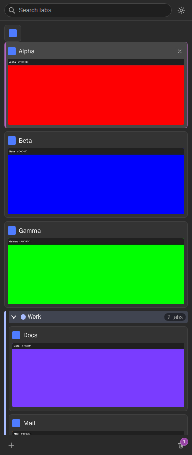
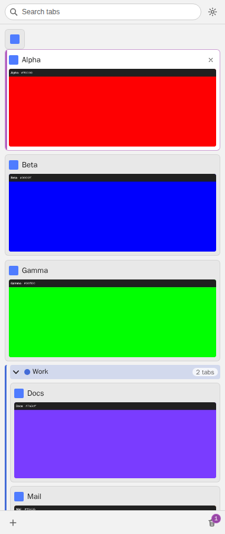
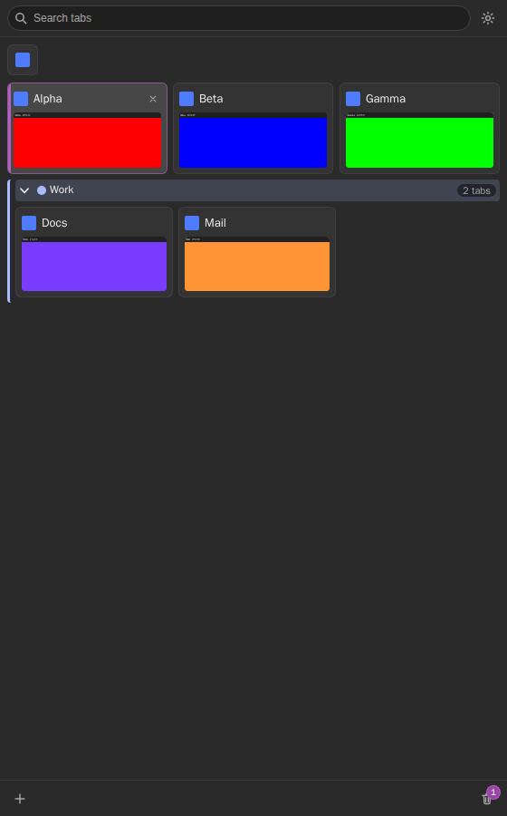

# Vertical Tabs

*[日本語版 / Japanese](README.ja.md)*

A Chrome extension (Manifest V3) that puts a **vertical tab list with page previews** into
Chrome's side panel. Every tab of the current window becomes a card with a
favicon, a title and a top-cropped screenshot of the page, so you can recognise a tab by how
it *looks* rather than by a 12-character title fragment.

No build step, no bundler, no npm dependencies: the `extension/` folder is loaded directly
with **Load unpacked**.



| Light theme | Three columns on a wide panel |
| --- | --- |
|  |  |

> The three images above are produced by the test suite (`tests/specs/10-showcase.spec.js`),
> which writes them to the git-ignored `tests/output/screenshots/`; the copies committed under
> `docs/screenshots/` are what these links resolve to.
> [`docs/screenshots/README.md`](docs/screenshots/README.md) has the two commands that
> regenerate and copy all three.

---

## Contents

1. [Features](#features)
2. [Install](#install)
3. [Put the panel on the right](#put-the-panel-on-the-right)
4. [Turn off Chrome's own vertical tab strip](#turn-off-chromes-own-vertical-tab-strip)
5. [Usage](#usage)
6. [Settings](#settings)
7. [Permissions](#permissions)
8. [Privacy](#privacy)
9. [Known limitations](#known-limitations)
10. [Development and tests](#development-and-tests)
11. [Troubleshooting](#troubleshooting)
12. [Manual checks](#manual-checks)
13. [License](#license)

---

## Features

- **Vertical list of tab cards** for the current window, in the side panel.
- **Page previews**: a top-cropped 640 × 240 JPEG of the page, captured when you show a tab
  and refreshed on a timer. Never-shown tabs keep a dark placeholder,
  and a page Chrome will never let an extension capture — `chrome://`, the Web Store, other
  extensions' pages — says so on the card instead of showing an empty box.
- **Choose the column count**: 1 to 5 columns of cards, **one by default** — one full-width
  card per row. A panel too narrow for the number you picked shows as many columns as fit
  rather than shrinking the cards.
- **Choose the card size**: pick how big a card should be and the panel fits as many of
  them across as it can. At Chrome's minimum panel width, 160 px cards land two per row —
  the density a vertical tab strip is usually drawn at.
- **A tools column beside the tabs**: Chrome will not let the panel be narrower than
  360 px, so the width left over holds the things a tab list cannot say in a row —
  **saved tab sets** you can reopen later, **recently used** tabs in the order you were
  actually on them, **your windows** with what each one holds, **group by site** which files loose tabs into
  one tab group per host, a **duplicate finder**, an **idle-tab sweeper**
  that hibernates what you have not touched in days, what is **using sound**, and a
  **list in and out** which copies the window as Markdown and opens a pasted list of
  links in a window of its own, and a **notes** pad that survives a restart. Pick which ones you want in Settings; the order
  you tick them is the order they stack, and unticking them all hides the column. None of
  them uses the network or needs a permission the previews did not already require.
- **Or bookmarks in that same column**: switch the column from tools to bookmarks and it
  becomes your own folders, one level at a time — click a row to open it, a dot marks
  anything already open in a tab, and one button bookmarks the tab you are on. This is the
  one feature that does ask for a permission the previews did not already require, and it
  asks the first time you switch to it, never at install: `bookmarks` is declared in
  `optional_permissions`. Apart from that one button it is read-only — no renaming, no
  deleting, no reordering, no dragging between the two lists. Switching back restores your
  tools exactly as they were, because the tool list itself is never rewritten.
- **Lock a tab**: right-click, *Lock this tab*. A locked tab **cannot be closed from this
  panel** — not by the card's close button, not by *Close tab*, not by *Close the other
  tabs*, not by the duplicate finder. Chrome's own close button and Ctrl+W **still close
  it**: an extension cannot veto `tabs.onRemoved`, and that limit is permanent. Locks are
  forgotten when the browser restarts, because the tab ids they name are.
- **Pop the list out**: open the tab list in a window of its own, which is not bound by
  Chrome's 360 px floor — it opens at 260 px and keeps driving the window it came from.
- **Pinned tabs** as a compact icon grid.
- **Tab groups** rendered as coloured stacks that can be collapsed, renamed and recoloured.
- **Closed-tabs trash** with one-click restore, including whole closed windows.
- **Search** across titles and URLs, with full-width/half-width normalisation for Japanese.
  While a search is running, matches **in other windows** are listed below the tab list;
  choosing one brings that window forward and opens the tab.
- **Drag and drop**: reorder, pin/unpin, join or leave a group, move a whole group, drag a
  card out as a link, drop a link in to open it.
- **Keyboard navigation** with a roving focus, plus two global shortcuts.
- **Unread dots** for tabs opened in the background, **hibernate**, **mute**, and a
  click-the-active-tab-to-go-back option.
- **English and Japanese** UI, following Chrome's own UI language.
- Dark and light themes that follow the system setting.

---

## Install

**[Install from the Chrome Web Store](https://chromewebstore.google.com/detail/vertical-tabs/ofajdfikeepefnogjblgcecnmopanaak)** — the short way.

To load it by hand, or to run a development build:

> **Setting this up on another machine?** → the zip is on [Releases](../../releases/latest):
> ```
> gh release download v1.0.0 --repo d4rulyn/vertical-tabs --pattern '*.zip'
> ```
> The walkthrough is **[the install guide](https://d4rulyn.github.io/vertical-tabs/install.html)**, a
> single page you open in a browser: building the zip, loading it, the permission the
> previews cannot work without, updating, and what to do when something looks wrong.
>
> The distributable zip is built in Docker, so nothing lands on the host:
> ```
> docker run --rm --user "$(id -u):$(id -g)" -v "$PWD":/work -w /work \
>   python:3.12-slim python tools/package.py
> ```
> It writes `dist/vertical-tabs-<version>.zip`, byte-identical for a given commit.


The extension is not on the Chrome Web Store; load it from disk.

1. Clone or download this repository.
2. Open `chrome://extensions`.
3. Turn on **Developer mode** (top right).
4. Click **Load unpacked** and select the **`extension/`** folder of this repository
   (not the repository root).
5. Optional but recommended: click the puzzle-piece icon in the toolbar and **pin**
   *Vertical Tabs* so its icon is always visible.

Chrome 120 or newer is required (`minimum_chrome_version: 120`).

### Opening the panel

| How | What happens |
| --- | --- |
| Click the toolbar icon | Toggles the panel for the current window. |
| `Ctrl+Shift+E` (`Cmd+Shift+E` on macOS) | Same toggle. |
| `Alt+Shift+S` | Opens the panel **and** focuses the search box. |
| The first-run page's **Open the tab bar now** button | Opens the panel for that window. |

Both shortcuts can be changed at `chrome://extensions/shortcuts`. The panel has to be opened
per window by you: Chrome only lets an extension open a side panel in response to a user
gesture, so it can never appear on its own.

---

## Put the panel on the right

Chrome — not the extension — decides which side the side panel is docked on. It is a browser
setting and defaults to the right for left-to-right locales.

1. Open **Chrome settings › Appearance**.
2. Find the side panel position setting and set it to **Right**.

If your panel is on the left, the extension shows a one-time hint with a button that opens
that settings page for you. There is no API for an extension to move the panel, so this is
the only way.

---

## Turn off Chrome's own vertical tab strip

Some Chrome builds have their own vertical tab strip. If it is enabled you will end up with
**two** vertical tab lists side by side. Turn Chrome's off (right-click the tab strip, or look
under Settings › Appearance) and keep this one.

This extension can neither read nor change that setting, and it cannot hide Chrome's
horizontal tab strip either — no extension API exists for that.

---

## Usage

### Pointer

| Gesture | Where | Action |
| --- | --- | --- |
| Left click | card / pinned tile | Activate that tab. If it is already active and *"Clicking the active tab switches to the previous tab"* is on, go back to the previously used tab. |
| `Ctrl`/`Cmd` + click | card | Add or remove the tab from the multi-selection. |
| `Shift` + click | card | Select a range of tabs. |
| Middle click | card / pinned tile | Close the tab (can be turned off). |
| Click | the × on a card | Close that tab. |
| Click | the speaker icon | Mute or unmute the tab. |
| Double click | empty space in the list | Open a new tab (can be turned off). |
| Right click | card, tile, group header, empty space | Context menu. |
| Click | group header | Collapse or expand the group. |
| Double click | group title | Rename the group. |
| Click | group colour swatch | Pick one of Chrome's nine group colours. |
| Click / middle click | **+** at the bottom | New tab in the foreground / in the background. |
| Click | the trash icon | Recently closed tabs. |
| Click | the gear icon | Settings. |

### Drag and drop

- Drag a card up or down to reorder it; drag several at once when they are multi-selected.
- Drop a card on the **pinned grid** to pin it; drag a pinned tile back into the list to unpin.
- Drop a card **inside a group** to join it, or below the group to leave it.
- Drag a **group header** to move the whole group.
- Drag a card **out of the panel** to drop the page's URL somewhere else.
- Drop a **link from anywhere** into the list to open it as a background tab at that position.
- While Chrome is animating a native tab drag every tab edit fails; the panel retries and
  then shows a short "could not complete that action" message.

### Keyboard (inside the panel)

| Key | Action |
| --- | --- |
| `ArrowDown` / `ArrowUp` | Next / previous card. With more than one column, moves by one row. |
| `ArrowLeft` / `ArrowRight` | Previous / next card when there is more than one column; in a single column, `ArrowLeft` on a card inside a group jumps to the group header. |
| `Home` / `End` | First / last card. |
| `Enter` / `Space` | Activate the focused tab. |
| `Delete` / `Backspace` | Close the focused tab. |
| `Alt+ArrowUp` / `Alt+ArrowDown` | Move the focused tab one position. |
| `Shift+ArrowUp` / `Shift+ArrowDown` | Extend the selection. |
| `/`, `Ctrl+K`, `Ctrl+F` | Focus the search box. |
| `Ctrl+Shift+P` | Open the **command palette** — everything the panel can do, by name. |
| `Escape` | Close a menu, then clear the search, then leave the list. |
| `ContextMenu` / `Shift+F10` | Context menu for the focused card. |

### Previews

A preview is a screenshot of a tab **while it is the visible tab of its window** — that is the
only thing Chrome lets an extension capture. So:

- A tab gets its first preview shortly after you show it for the first time.
- Tabs you have never visited keep a dark placeholder.
- The preview of the tab you are leaving is refreshed at the moment you switch away, when the
  switch is started from the panel (`Update the preview of the tab you are leaving`).
- Previews are stored by URL, so a restored tab, a duplicate, and a tab reopened after a
  browser restart all show the stored image immediately.
- A card can briefly show the previous page dimmed ("stale") right after a navigation.

---

## Settings

Open the gear icon in the panel. Settings are stored per device in `chrome.storage.local`.

| Setting | Values | Default | What it does |
| --- | --- | --- | --- |
| Theme | Follow system / Dark / Light | Follow system | Panel colours. |
| Columns | 1 – 5 | 1 | How many columns of cards the list shows. A panel too narrow for the number you pick shows as many columns as fit (never a card below 96 px); widen the panel and the rest come back. |
| Show tab previews | on / off | on | Off turns the cards into compact 34 px rows. |
| Show pinned tabs as a compact grid | on / off | on | Off renders pinned tabs inline with a pin badge. |
| Middle-click closes a tab | on / off | on | |
| Double-click empty space to open a new tab | on / off | on | |
| Mark tabs opened in the background as unread | on / off | on | |
| Clicking the active tab switches to the previous tab | on / off | off | |
| Ask before closing this many tabs at once | 2 – 50 | 5 | Shows an in-panel confirm bar. |
| Previews show | The top of the page / what it showed when it loaded / wherever you are | The top of the page | See *What a preview is a picture of* below. |
| Refresh the active tab's preview | Only when switching tabs / 30 s / 1 min / 5 min | 1 min | Keeps the visible tab's preview current. |
| Update the preview of the tab you are leaving | on / off | on | Captures the outgoing tab when the switch starts in the panel. |
| Capture previews while the tab bar is closed | on / off | on | Off pauses captures whenever no panel is open. |
| Keep previews after Chrome restarts | on / off | on | Off deletes the preview cache at browser startup. |
| Never capture previews on these sites | host list | empty | One host per line; `*.example.com` includes subdomains. |
| Clear preview cache | button | — | Asks for confirmation, then deletes every stored preview. |

### What a preview is a picture of

A preview is taken with `captureVisibleTab`, so it shows **only the visible part of a page**.
Chrome puts you back where you were when a page reloads, so pressing F5 half way down an
article produces a picture of that half way point: a band of body text that identifies
nothing. This setting decides what happens then.

| Value | Behaviour |
| --- | --- |
| **The top of the page** (default) | Keeps the preview on the page header. A capture is taken while the viewport is at the top, and while you have scrolled away an existing top-of-page preview is **not** overwritten. A tab with no preview yet is captured wherever it sits, so a card is never left blank waiting for someone to scroll up. |
| What it showed when it loaded | Frozen at the last load. Only a navigation or an explicit refresh replaces it. |
| Wherever you are on the page | Follows the reader: every capture replaces the preview, which is what the refresh interval and switching tabs already do. |

Whether the page is at the top is read from its scroll offset (`scripting` permission;
measured at 5 ms for the first read into a tab and 1 ms after that). Pages the extension
cannot touch, such as the PDF viewer, cannot be asked, and behave as *wherever you are*.

The Shortcuts section shows the current key bindings and links to
`chrome://extensions/shortcuts`.

---

## Permissions

| Permission | Why it is needed | Install warning |
| --- | --- | --- |
| `sidePanel` | The UI surface itself. | none |
| `tabs` | Reads `url` / `title` / `favIconUrl` of tabs — without it the API hides them. | Suppressed, because `<all_urls>` is requested as well. |
| `host_permissions: <all_urls>` | **The only way to take previews automatically.** Chrome refuses `captureVisibleTab` without host access to the page. | "Read and change all your data on all websites" |
| `tabGroups` | Render, collapse, rename, recolour and move tab groups. | — (not verified on real Chrome yet) |
| `sessions` | The closed-tabs trash and its restore. | — (not verified on real Chrome yet) |
| `storage` | Settings and internal bookkeeping. | none |
| `unlimitedStorage` | Keeps the preview cache out of Chrome's eviction. | none |
| `favicon` | Falls back to Chrome's favicon service while a page is still loading. | none |
| `alarms` | The periodic preview refresh and the cache maintenance job. | none |
| `scripting` | Reads the scroll offset when **Previews show** is set to the top of the page. The one value read is `window.scrollY`; nothing is written to the page. | — (not verified on a real install) |
| `optional_permissions: bookmarks` | The bookmarks layout of the side column. Reads the tree to draw the list; the only write is *Bookmark this tab*. **Optional** — not in `permissions`, so it is not requested at install, and never requested at all unless you switch that column to bookmarks and press its grant button. | none at install. The runtime prompt shown when you grant it: — (not read on real Chrome yet) |

Deliberately **not** requested: `activeTab`, content scripts, `contextMenus`,
`offscreen`. The extension injects nothing into web pages.

The cells marked "—" are filled in once the prompts have been read on real Chrome
(see [Manual checks](#manual-checks)); this README does not guess at strings it has not seen.

---

## Privacy

- Previews never leave your computer. They are stored in the extension's own IndexedDB
  database and are only ever read by the panel.
- The extension makes **no network requests at all** — no analytics, no telemetry, no remote
  code, no external fonts or images, no crash reporting, nothing on install or update. A
  weather and a calendar tool were built and then removed for exactly this reason: neither
  was worth spending that sentence on. `tests/specs/22-widgets.spec.js` asserts it with
  every tool on screen, so the promise fails a test rather than quietly rotting.
- **Bookmarks are read, not collected.** With the bookmarks layout granted, the extension
  reads your bookmark tree to draw the list and does nothing else with it: it is never
  copied into the extension's own storage, and — like everything else here — never sent
  anywhere. Revoke the permission in `chrome://extensions` and the column goes straight
  back to asking for it.
- **Incognito tabs are never captured**, whatever the settings say.
- `chrome://` pages, the Chrome Web Store, other extensions' pages, `data:` and `about:blank`
  are never captured — Chrome does not allow it.
- Add hosts to *"Never capture previews on these sites"* to keep sensitive sites out of the
  cache entirely. Adding a host also **deletes the previews already stored for it**, so you
  can add a site after the fact rather than having to decide before you first visit it.
- Turn off *"Keep previews after Chrome restarts"* to make the cache last only for the
  current browser session.
- *"Clear preview cache"* deletes everything immediately.

---

## Known limitations

- Chrome's side panel **cannot be narrower than 360 px**, and its side is a browser setting.
  That floor is hard-coded in Chrome (raised from 320 px), there is no flag for it, and an
  extension cannot change it: `sidePanel.setOptions({width})` is rejected outright and
  `getLayout()` reports only which side the panel is on. A Chrome engineer has confirmed on
  the chromium-extensions list that extensions are not given control of it, because many
  Chrome features share the panel. Choosing a smaller **card size** is the only way to make
  the strip feel narrower; it packs more, smaller cards into the width Chrome insists on.
  A 170 px-wide bar is therefore impossible — the default single column is a wider version
  of one. Four columns need roughly a 430 px panel and five roughly 530 px; below that
  the panel shows fewer columns rather than thinner cards.
- Chrome's native horizontal tab strip cannot be hidden by an extension, and Chrome's own
  vertical tab strip can neither be detected nor switched off by one.
- Only the **active tab of a window** can be captured, and Chrome allows roughly **one capture
  per second** for the whole extension. Previews therefore appear 0.35 – 1.5 s after a tab is
  shown, and with many windows they arrive one after another.
- `tabs.onActivated` does not report the tab you are *leaving*, so the outgoing tab's preview
  can only be refreshed when the switch is started from this panel. Switching with `Ctrl+Tab`
  or the native tab strip leaves that job to the periodic refresh.
- No previews for `chrome://` pages, the Chrome Web Store, other extensions' pages,
  `data:`/`about:blank`, `file://` URLs (unless *Allow access to file URLs* is on), incognito
  tabs, excluded hosts, or when a managed policy disables screenshots.
- Minimized windows are not captured until they are shown again. Background (non-focused)
  windows **are** captured normally.
- Two tabs with the same URL share one preview.
- The panel must be opened per window by you; `sidePanel.open()` requires a user gesture.
- Dragging tabs between windows requires both windows' panels to be open.
- Tab group colours approximate Chromium's palette (Chrome publishes no hex values).
- "Capture previews while the tab bar is closed = off" is precise only on Chrome 142+, which
  reports when a side panel closes. On older builds captures pause only when no panel is open
  anywhere.
- Chrome below 140 cannot detect which side the panel is docked on, so the hint never appears
  there.

---

## Development and tests

### Layout

```
extension/          the whole product — this is the "Load unpacked" target
  manifest.json
  _locales/en|ja/   every user-visible string
  background/       MV3 service worker: capture scheduling, alarms, messaging
  common/           pure modules shared by the worker, the panel and the welcome page
  sidepanel/        the panel UI
  welcome/          first-run page, also the options page
tests/              Playwright end-to-end tests + Node unit tests (Docker only)
tools/              icon generator (Pillow, run in Docker)
docs/screenshots/   README images
```

There is **no build step**. Edit a file, press the reload button on `chrome://extensions`,
and reopen the panel.

### Running the tests

Everything runs inside `mcr.microsoft.com/playwright:v1.62.1-noble` (Chromium 151, Node 24).
Nothing is installed on the host — that is a hard rule of this project. Run everything from
the repository root:

```bash
mkdir -p logs
export HOST_UID=$(id -u) HOST_GID=$(id -g)

# 1. build the test image (first run also installs @playwright/test 1.62.1 into it)
docker compose -f tests/docker-compose.yml build 2>&1 | tee logs/e2e-build.log

# 2. unit tests (pure modules + i18n parity) — a few seconds
docker compose -f tests/docker-compose.yml run --rm e2e npm run unit 2>&1 | tee logs/unit.log

# 3. the Playwright suite
docker compose -f tests/docker-compose.yml run --rm e2e 2>&1 | tee logs/e2e.log
```

Results:

- HTML report: `tests/output/report/index.html`
- Screenshots: `tests/output/screenshots/`
- Traces of failed tests: `tests/output/artifacts/`

`tests/output/` and `logs/` are git-ignored, and the container runs as your own uid/gid so
everything it writes stays yours.

To pin the dependency versions, generate the lockfile once — again inside the image:

```bash
docker run --rm -v "$PWD/tests:/t" -w /t \
  mcr.microsoft.com/playwright:v1.62.1-noble npm install --package-lock-only
```

A headed smoke test exists for the cases where the GPU path matters. It needs a virtual
display and is skipped otherwise:

```bash
docker compose -f tests/docker-compose.yml run --rm e2e npm run test:headed 2>&1 | tee logs/e2e-headed.log
```

### How the tests work

- The extension is loaded with `chromium.launchPersistentContext` using
  `channel: 'chromium'` plus `--disable-extensions-except` and `--load-extension`. Playwright's
  default headless shell and branded Chrome both ignore `--load-extension`; this combination
  is the one that works, and `captureVisibleTab` works in it too.
- Every capture spec uses a **two-window harness**: the fixture pages live in a second window,
  while the panel document is opened as a normal tab in the first window so it stays visible
  (`requestAnimationFrame`, `IntersectionObserver` and screenshots all need that). Passing
  `?windowId=` scopes the panel to the other window; the real side panel never takes a query
  string, and one spec covers that production path too.
- Fixture pages come from a tiny HTTP server inside the container. There is no internet
  access, and `about:blank` / `data:` pages cannot be captured by design.
- The suite asserts that the extension's own capture limiter **never** produces a
  `MAX_CAPTURE_VISIBLE_TAB_CALLS_PER_SECOND` error, and separately that the quota is real by
  provoking it directly. Serialisation is measured on the limiter's own call timestamps
  (`vt/get-diagnostics` → `lastCallByWindow`), not on when the screenshots came back.
- Most specs run with three to six tabs, which fits in the panel. `15-list-scroll.spec.js`
  deliberately opens 18 in a 380 × 700 panel so the list has to scroll, and checks that the
  cards keep their full height and their 8:3 preview instead of being squeezed to fit.

### Regenerating the icons

```bash
docker run --rm -v "$PWD":/work -w /work python:3.12-slim \
  sh -c "pip install -q pillow && python tools/make_icons.py"
```

The PNGs are committed, so *Load unpacked* never needs any tooling.

---

## Troubleshooting

**The panel went blank after updating or reloading the extension.** Close the side panel and
open it again. Reloading an extension destroys the panel document that was already open —
measured: the page is closed outright — while the title bar above it stays, because that bar
belongs to Chrome and not to the panel. Nothing is lost; settings and previews are still there.

**No previews at all.** Open `chrome://extensions`, click this extension's **Details**, and
set **Site access** to *On all sites*. With *On click* or *On specific sites* Chrome refuses
every screenshot; the panel then shows a yellow banner saying so, and each card explains
itself. Managed devices may also block hosts through the `runtime_blocked_hosts` policy.

**A yellow "screenshots are disabled by policy" banner.** A managed policy (for example
`DisableScreenshots`) blocks screen captures browser-wide. Previews pause for ten minutes and
then try again.

**One tab never gets a preview.** Check its URL: `chrome://`, the Chrome Web Store, other
extensions' pages, `data:` and `about:blank` can never be captured. `file://` URLs need
*Allow access to file URLs* on the extension's details page. The card's tooltip says which
case applies.

**Previews stop while a window is minimized.** That is expected; the window is captured again
when you bring it back.

**Still empty after reopening, or showing an error.** Open `chrome://extensions` and look for an
*Errors* button on this extension, then reload it — and reopen the panel afterwards, as above.

**The panel is on the wrong side.** See [Put the panel on the right](#put-the-panel-on-the-right).

---

## Manual checks

A few things cannot be automated in headless Chromium. Run these once on real Chrome:

1. The toolbar icon toggles the panel; `Ctrl+Shift+E` / `Cmd+Shift+E` toggles it; the icon's
   tooltip shows the **current** binding.
2. `chrome://extensions` → *Details* → **Site access** → *On click*: previews stop, the
   site-access banner appears, cards explain themselves; restoring *On all sites* resumes
   previews without a reload.
3. Record the exact install-warning strings shown for `tabGroups` and `sessions` and paste
   them into the permission table above.
4. Record the exact label of Chrome's side-panel-position control in Settings › Appearance and
   paste it into this README (never into the in-panel hint, which stays version-agnostic).
5. Record whether this Chrome build has its own vertical tab strip and how it is turned off.
6. The side-position hint appears when the panel is docked on the left, and never on the right.
7. With a screenshot-disabling policy in place, previews pause and the policy banner appears.
8. Drag and drop inside the **real** side panel: reorder, pin, drop into a group, drag a group
   header, drag a card out to another window.
9. Headed capture on Windows and macOS produces previews rather than `image readback failed`.
10. On a fresh profile at the default panel width, the list shows a single column, and picking
    2 – 5 in Settings changes it immediately.
11. A `chrome://` tab's card shows a lock and "No preview" instead of an empty dark box, in
    both the dark and the light theme.

---

## License

MIT. See [LICENSE](LICENSE).
